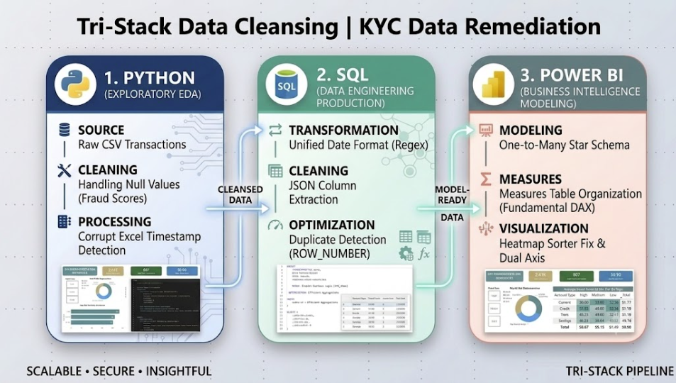

# Tri-Stack Data Cleansing | KYC Data Remediation

An enterprise-grade risk pipeline that ingests raw, erratic banking transactions, runs automated SQL normalization and deduplication, and generates a production-ready Power BI dashboard to flag operational exposures.

## 🛠️ The Tri-Stack Pipeline

### 1. Python (Exploratory Data Analysis)
* **Ingestion & Profiling:** Evaluated raw transaction histories (`5,000` rows) to isolate data pipeline failures.
* **Anomaly Isolation:** Detected corrupt Excel date serialization integers (`45734`), raw JSON strings wrapped inside unstructured metadata fields, and missing numeric fraud scores.

### 2. PostgreSQL (Data Engineering Production)
* **Regex Standardization:** Deployed robust `CASE WHEN` string parsing to normalize mixed-format date configurations.
* **JSON Extraction:** Stripped out inline metadata properties into explicit, indexable `risk_tier` and `account_type` columns.
* **Window Function Deduplication:** Implemented `ROW_NUMBER() OVER (PARTITION BY customer_id ORDER BY transaction_timestamp DESC)` to eliminate historical data noise, yielding a lean core of `2,413` unique, verified customer profiles.

### 3. Power BI (Business Intelligence Modeling)
* **Star Schema Architecture:** Created a direct One-to-Many ($1 \rightarrow *$) relationship model between the transaction table and a custom DAX calendar dimension.
* **UX Sorting Adjustments:** Resolved default alphabetical sorting limitations by mapping text tiers to a numerical indexing hierarchy (`High` = 1, `Medium` = 2, `Low` = 3).
* **Interactive Threat Analytics:** Constructed a dual-axis operational timeline chart and a conditional matrix heatmap to track vulnerability spikes simultaneously.

## 📊 Deep-Dive Risk Insights Uncovered
* 📉 **The Risk Concentration Hotspots:** Current accounts carry the highest overall risk profile with an average fraud score of 51.77. However, when isolating the critical "High" risk segment specifically, Credit accounts surge to the front with a peak severity index of 51.93.
* 📈 **Scale Stress Testing:** Transaction volumes expanded exponentially by 294% over the tracked period, leaping from 192 monthly transactions to a peak of 758. Despite this scaling, the portfolio's average fraud baseline remained tight between 49.9 and 53.3.
* 🚨 **Audit Backlog Inbound:** A critical 33.44% of total deduplicated data (807 accounts) is classified under the "High" risk segment, allowing management to optimize team assignments based on exact risk severity.

## Screenshots:

